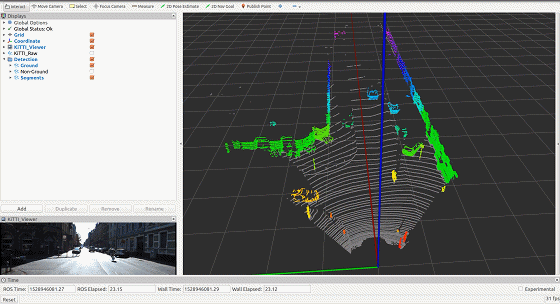
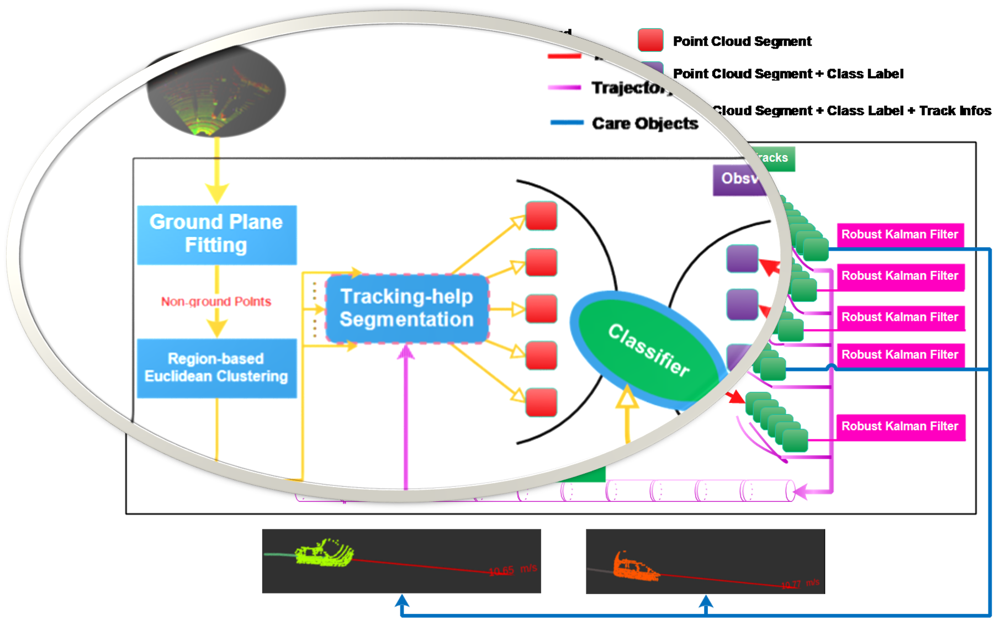

# segmenters_lib
[](https://circleci.com/gh/LidarPerception/segmenters_lib/tree/master)

　　The LiDAR segmenters library, for segmentation-based detection.
<p align="center">
    
</p>

## How to use
1. We name your ros workspace as `CATKIN_WS` and `git clone` as a ROS package, with [common_lib](https://github.com/LidarPerception/common_lib) and [object_builders_lib](https://github.com/LidarPerception/object_builders_lib) as dependencies.
    ```bash
    $ cd $(CATKIN_WS)
    # we recommand you to organize your workspace as following
    $ mkdir -p src/common
    $ mkdir -p src/perception/libs
    
    # git clone basic libraries, like common_lib
    $ cd $(CATKIN_WS)/src/common
    $ git clone https://github.com/LidarPerception/common_lib.git libs
    
    # git clone perception libraries, segmenters_lib and its dependencies
    $ cd $(CATKIN_WS)/src/perception/libs
    $ git clone https://github.com/LidarPerception/roi_filters_lib.git roi_filters
    $ git clone https://github.com/LidarPerception/object_builders_lib.git object_builders
    $ git clone https://github.com/LidarPerception/segmenters_lib.git segmenters
    
    # build your ros workspace for our segmentation-based detection demo
    # uncomment add_subdirectory() in src/perception/libs/segmenters/CMakeLists.txt, git diff as following:
    -#add_subdirectory(example)
    +add_subdirectory(example)
    $ cd $(CATKIN_WS)
    $ catkin build -DCMAKE_BUILD_TYPE=Release
    ```
2. Run demo under [KiTTI raw dataset](http://www.cvlibs.net/datasets/kitti/raw_data.php) using [kitti_ros](https://github.com/LidarPerception/kitti_ros.git)'s replayer.
    ```bash
    $ cd $(CATKIN_WS)/src
    $ git clone https://github.com/LidarPerception/kitti_ros.git
    # build your ros workspace for our segmentation-based detection demo
    $ cd ..
    $ catkin build -DCMAKE_BUILD_TYPE=Release
    ```
    + **Terminal 1**: KiTTI raw dataset replay, [more tutorials](https://github.com/LidarPerception/kitti_ros#how-to-use).
        ```bash
        $ cd $(CATKIN_WS)
        $ source devel/setup.bash
        # change Mode for Keyboard Listening Device
        $ sudo chmod 777 /dev/input/event3
        # launch kitti_ros's kitti_player for frame-by-frame algorithm testing
        $ roslaunch kitti_ros kitti_player.launch
        ```
    + **Terminal 2**: launch **Seg-based Detector** demo.
        ```bash
        $ cd $(CATKIN_WS)
        $ source devel/setup.bash
        $ roslaunch segmenters_lib demo.launch
        ```
3. Follow the [demo example](./example) to use our LiDAR segmenters library.
    + Cascadingly use **roi_filter**, **ground_remover** and **non_ground_segmenter** for Point Cloud perception, like our **Seg-based Detector**: [detection_node](./example/detection_node.cpp).
    + Refer to our [CMakeLists.txt](./example/CMakeLists.txt) for building your own ros package using this library.
    <p align="center">
        
    </p>

## [Parameters](./launch/demo.launch)
+ Demo parameters, defined in [detection.yaml](./config/kitti/detection.yaml)
    + Subscribe Point Cloud in topic `sub_pc_topic`, default is **/kitti/points_raw** _(sensor_msgs/PointCloud2)_.
    + Publish **Ground Point Cloud** in topic `pub_pc_ground_topic`, default is **/segmenter/points_ground** _(sensor_msgs/PointCloud2)_.
    + Publish **Non-Ground Point Cloud** in topic `pub_pc_nonground_topic`, default is **/segmenter/points_nonground** _(sensor_msgs/PointCloud2)_.
    + Publish **Candidate Objects Cloud**, different objects with different intensity, in topic `pub_pc_clusters_topic`, default is **/segmenter/points_clustered** _(sensor_msgs/PointCloud2)_.
+ Segmenters algorithm parameters, defined in [segmenter.yaml](./config/kitti/segmenter.yaml).
    + Get these paramters using `common::getSegmenterParams(const ros::NodeHandle& nh, const std::string& ns_prefix)` in [common_lib](https://github.com/LidarPerception/common_lib/blob/master/include/common/parameter.hpp).
    + Adjust some paramters to your hardware installation.


## TODO lists
### Ground Segmenters
- [x] PCL RANSAC, [ICCV2011 PCL-Segmentation](./doc/ICCV2011%20PCL-Segmentation.pdf)
    > Refer: [PCL: Plane model segmentation](http://pointclouds.org/documentation/tutorials/planar_segmentation.php#planar-segmentation)
- [x] GPF (Ground Plane Fitting), ICRA 2017
    ```bibtex
    @inproceedings{zermas2017fast,
      title={Fast segmentation of 3d point clouds: A paradigm on lidar data for autonomous vehicle applications},
      author={Zermas, Dimitris and Izzat, Izzat and Papanikolopoulos, Nikolaos},
      booktitle={Robotics and Automation (ICRA), 2017 IEEE International Conference on},
      pages={5067--5073},
      year={2017},
      organization={IEEE}
    }
    ```
- [ ] [linefit_ground_segmentation](https://github.com/lorenwel/linefit_ground_segmentation), IV 2010
    ```bibtex
    @inproceedings{himmelsbach2010fast,
      title={Fast segmentation of 3d point clouds for ground vehicles},
      author={Himmelsbach, Michael and Hundelshausen, Felix V and Wuensche, H-J},
      booktitle={Intelligent Vehicles Symposium (IV), 2010 IEEE},
      pages={560--565},
      year={2010},
      organization={IEEE}
    }
    ```
- [ ] [depth_clustering](https://github.com/PRBonn/depth_clustering), IROS 2016
    ```bintex
    @inproceedings{bogoslavskyi2016fast,
      title={Fast range image-based segmentation of sparse 3D laser scans for online operation},
      author={Bogoslavskyi, Igor and Stachniss, Cyrill},
      booktitle={Intelligent Robots and Systems (IROS), 2016 IEEE/RSJ International Conference on},
      pages={163--169},
      year={2016},
      organization={IEEE}
    }
    ```
- [ ] Scan Line Run, ICRA 2017, like Standford's Junior self-driving car.
    ```bibtex
    @inproceedings{zermas2017fast,
      title={Fast segmentation of 3d point clouds: A paradigm on lidar data for autonomous vehicle applications},
      author={Zermas, Dimitris and Izzat, Izzat and Papanikolopoulos, Nikolaos},
      booktitle={Robotics and Automation (ICRA), 2017 IEEE International Conference on},
      pages={5067--5073},
      year={2017},
      organization={IEEE}
    }
    @incollection{montemerlo2009junior,
      title={Junior: The stanford entry in the urban challenge},
      author={Montemerlo, Michael and Becker, Jan and Bhat, Suhrid and Dahlkamp, Hendrik and Dolgov, Dmitri and Ettinger, Scott and Haehnel, Dirk and Hilden, Tim and Hoffmann, Gabe and Huhnke, Burkhard and others},
      booktitle={The DARPA Urban Challenge},
      pages={91--123},
      year={2009},
      publisher={Springer}
    }
    ```
- [ ] Deep-learning: FCN, IV 2017
    ```bibtex
    @inproceedings{caltagirone2017fast,
      title={Fast LIDAR-based road detection using fully convolutional neural networks},
      author={Caltagirone, Luca and Scheidegger, Samuel and Svensson, Lennart and Wahde, Mattias},
      booktitle={Intelligent Vehicles Symposium (IV), 2017 IEEE},
      pages={1019--1024},
      year={2017},
      organization={IEEE}
    }
    ```
### Non-ground Segmenters
- [x] PCL Euclidean Cluster Extraction, [ICCV2011 PCL-Segmentation](./doc/ICCV2011%20PCL-Segmentation.pdf)
    > Refer: [PCL: Euclidean Cluster Extraction](http://pointclouds.org/documentation/tutorials/cluster_extraction.php#cluster-extraction)
- [x] Region-based Euclidean Cluster Extraction
    ```bibtex
    @inproceedings{yan2017online,
      title={Online learning for human classification in 3d lidar-based tracking},
      author={Yan, Zhi and Duckett, Tom and Bellotto, Nicola},
      booktitle={Intelligent Robots and Systems (IROS), 2017 IEEE/RSJ International Conference on},
      pages={864--871},
      year={2017},
      organization={IEEE}
    }
    ```
- [ ] Model-based Segmentation, ITSC 2017
    ```latex
    @article{shin2017real,
      title={Real-time and accurate segmentation of 3-D point clouds based on Gaussian process regression},
      author={Shin, Myung-Ok and Oh, Gyu-Min and Kim, Seong-Woo and Seo, Seung-Woo},
      journal={IEEE Transactions on Intelligent Transportation Systems},
      volume={18},
      number={12},
      pages={3363--3377},
      year={2017},
      publisher={IEEE}
    }
    ```
- [ ] Probabilistic Framework, RSS 2016
    ```bibtex
    @inproceedings{held2016probabilistic,
      title={A Probabilistic Framework for Real-time 3D Segmentation using Spatial, Temporal, and Semantic Cues.},
      author={Held, David and Guillory, Devin and Rebsamen, Brice and Thrun, Sebastian and Savarese, Silvio},
      booktitle={Robotics: Science and Systems},
      year={2016}
    }
    ```
    <p align="center">
        
    </p>
- [x] **Tracking-help Segmentation**. IV, 2012. Not yet in this repository.
    ```bibtex
    @inproceedings{himmelsbach2012tracking,
      title={Tracking and classification of arbitrary objects with bottom-up/top-down detection},
      author={Himmelsbach, Michael and Wuensche, H-J},
      booktitle={Intelligent Vehicles Symposium (IV), 2012 IEEE},
      pages={577--582},
      year={2012},
      organization={IEEE}
    }
    ```
